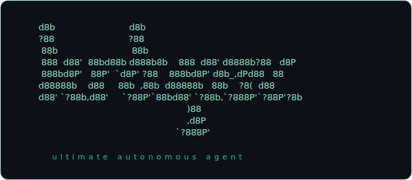

<div align="center">



<p>
  <a href="https://github.com/Arrosam/OpenKrakey/actions/workflows/ci.yml"></a>
  <a href="LICENSE"></a>
  <a href="package.json"></a>
  <a href="tsconfig.json"></a>
</p>

</div>

**OpenKrakey runs autonomous AI agents on a frame loop — like a game engine, not a chatbot.**
An agent wakes on a clock, looks at everything it knows, decides what to do (or to do nothing),
fires off any tools, and goes back to sleep — frame after frame. You talk to it through a local
web chat; run one agent or many, each isolated with its own files on disk.

<!-- launch TODO: drop the demo GIF here → assets/demo.gif (wizard → `krakey run` → web-chat reply → a frame firing live in the Inspector) -->

**Why it's different**

- **A frame loop, not request→response.** The agent acts every frame (or deliberately waits), so it
  monitors, follows up, and runs long tasks — instead of only replying when poked.
- **A tiny, domain-free kernel — everything is a plugin.** ~5 modules over typed contracts; the core
  knows nothing about LLMs, prompts, or memory. The chat window, file/shell tools, web search, the
  browser, even *which model it calls* are plugins. Read the whole kernel in one sitting.
- **Sturdy on flaky endpoints.** The loop is non-blocking and single-flight, so a provider hiccup
  doesn't cascade — context overflow auto-retries and shrinks the prompt; bursts coalesce; a failed
  call just retries on a shorter frame.

**vs. LangChain / AutoGPT / CrewAI:** those orchestrate a chat with a loop bolted on. Krakey is a
non-blocking *runtime* with a domain-free kernel — a different primitive, not a wrapper.

> **Status: `0.1.0`, early beta.** The kernel and L1 contracts are stable and test-enforced (the
> R1–R6 invariants — see [ARCHITECTURE.md](ARCHITECTURE.md)); plugins evolve faster, so pin a commit
> if you depend on one.

[Architecture](ARCHITECTURE.md) · [Build a plugin](docs/PLUGIN_DEV.md) · [Docs index](docs/README.md) · [Contributing](CONTRIBUTING.md)

## Install and setup

> **Prerequisites:** just a way to get the code — `git`, or download the repo ZIP. **The installer
> auto-installs Node.js ≥ 22** if you don't already have it. No database — an agent's whole state is
> plain files on disk. (The optional `browser` plugin drives your own Chrome; install Chrome only if
> you enable that plugin.)

**1 — Get the code**

```bash
git clone https://github.com/Arrosam/OpenKrakey.git
cd OpenKrakey
```

**2 — Install.** The installer **installs Node.js ≥ 22 for you if it's missing** — Homebrew or a
user-local nvm on macOS/Linux, winget on Windows (it asks first, and leaves an existing Node
untouched) — then runs `npm install` and puts the `krakey` command on your PATH:

```bash
./install.sh                                           # macOS / Linux
powershell -ExecutionPolicy Bypass -File install.ps1   # Windows
```

For an unattended run, set `KRAKEY_YES=1` (`$env:KRAKEY_YES=1` in PowerShell) to auto-confirm the
Node install. **Rather not put `krakey` on your PATH?** Skip the script, run `npm install`, and use
the npm scripts (`npm start` · `npm run config:web` · `npm run console`) or the launcher directly
(`./bin/krakey <command>`).

**3 — Connect a provider and create your first agent.** The guided wizard does the whole setup —
pick a provider, paste an API key (or reference an env var like `${ANTHROPIC_API_KEY}`), choose a
model, and name the agent. **The browser Console is the recommended way in:**

```bash
krakey dashboard    # recommended — the unified Console → http://127.0.0.1:7716
# …or stay in the terminal:
krakey setup        # the same setup as an arrow-key wizard
```

Prefer editing files? The wizard just writes JSON you can also hand-edit — copy the templates and
go (see [Configuration](#configuration) for the shapes):

```bash
cp config/llm.example.json            config/llm.json             # providers + keys
cp config/agent.default.example.json  config/agent.default.json   # the new-agent template
```

**4 — Run it**

```bash
krakey run          # boots every configured agent in the foreground (Ctrl+C to stop)
# …or in the background, then stop it later:
krakey start        # detaches; logs to .krakey/krakey.log
krakey stop         # stops the background instance(s)
```

`krakey run` prints a startup report and a **web-chat URL** with a one-time access token, e.g.
`http://127.0.0.1:7718/?token=…` — open it and start talking. Each message shows a *sent* → *read*
status as the agent reads it on its next frame.

**Where things live.** Each web surface is loopback-only, access-token gated, and on its own port:

| Surface | Start with | Opens at |
|---|---|---|
| **Console** — unified shell (Config · Chat · Inspector in one nav bar) | `krakey dashboard` · `npm run console` | `http://127.0.0.1:7716` |
| **Config** — providers, agents, plugins (+ onboarding wizard) | `npm run config:web` | `http://127.0.0.1:7717` |
| **Chat** — talk to your agent (the `web-chat` plugin) | `krakey run` · `krakey start` | `http://127.0.0.1:7718` |
| **Inspector** — live, read-only view of the agent's bus | `krakey run` · `krakey start` | `http://127.0.0.1:7719` |

The Console frames the other three — run config-web and at least one agent for its panels to fill in.

## What your agent can do

Capabilities are plugins. The default agent (`config/agent.default.example.json`) loads the set
below; `web-chat`, `memory-note`, and `history` are loaded as **private** (per-agent) plugins. `browser` is **off by default** —
it drives your own Chrome, so turn it on per agent when you want it. Add or remove any of them per
agent in its config.

| Plugin | Gives the agent | Notes |
|---|---|---|
| **web-chat** | A chat window to talk with you — the agent replies by calling `web-chat.send_message`. | Binds to loopback only and is access-token gated. Keeps its own transcript with sent/read status. |
| **krakeycode** | Files and shell: `read_file`, `write_file`, `edit_file`, `bash`, `list_dir`. | `local` mode (real paths) or `sandbox` mode (confined to a root + command allowlist). |
| **web-search** | Web search: `web-search.search`. | Keyless **DuckDuckGo** by default; or point `instanceUrl` at your own **SearXNG** — see [SECURITY.md](SECURITY.md). |
| **browser** | Read-only Chrome: `navigate`, `read_page`, `list_tabs`, `activate_tab`, `screenshot`. | Drives Chrome over the DevTools Protocol with **zero dependencies**. Never clicks, types, or runs scripts. |
| **interval_toggle** | Self-pacing: `interval.set` / `interval.hold` to change its own frame rate. | Drives the agent's clock over the bus — speed up under load, idle down when quiet. |
| **memory-note** | A private notebook: `memory-note.remember` / `memory-note.forget`. | The whole notebook re-renders into context every frame. Loaded **private** (per-agent). |
| **history** | A compacting log of every tool result, rendered as a trail. | Auto-captured; distills a checkpoint into `memory-note` when it compacts. Loaded **private**; requires `memory-note`. |
| **llm-core** | The LLM round-trip every chat request goes through. | Required by all of the above. Picks the model from config (or by capability). |
| **tool-manager** | The tool registry every tool plugin registers into (`llm.register_tool` / `llm.list_tools`). | **Required whenever any tool plugin is loaded** — the loader sequences it ahead of them and fails fast if it's missing. |
| **persona** | Its identity — the top of the system prompt. | Set the text in the agent's config. |
| **system-prompt** | Its operating rules (the *monologue rule*, below). | Channel-agnostic; teaches the general model. |
| **inspector** | A live, read-only dashboard of everything on the agent's bus. | Loopback + token gated. Great for watching frames, prompts, and tool results. |

Tool calls don't answer inline — a tool's result comes back as a message on the agent's **next
frame** (tagged with the plugin name), and the agent wakes immediately to read it.

## How it works

Each agent advances on a **frame** (every `intervalMs` — 15 min by default):

1. **Gather** — every plugin refreshes the context it contributes (identity, rules, the
   conversation, recent tool results).
2. **Compose** — the pieces are ordered into a system prompt + a message list.
3. **Send** — the prompt goes to the configured model, with all registered tools attached. *The
   frame ends here; it doesn't wait.*
4. **Act** — when the model answers, each tool call is dispatched asynchronously; results fold
   into a later frame.

**The monologue rule.** The plain text a model produces each frame is a *private monologue shown to
no one.* To do anything in the world — answer you, read a file, search the web — it must call a
**tool**. This is what keeps an idle frame cheap (just thinking) and makes every real action
explicit. It's taught by the `system-prompt` plugin and respected by every tool.

Because tool calls are fire-and-forget, the agent **never blocks on input** — a message you send
mid-task is simply read on the following frame. See [ARCHITECTURE.md](ARCHITECTURE.md) for the full
design.

## The CLI

`krakey` is the single entry point for everything. With no arguments (or `krakey help`) it prints
the usage. `krakey setup` opens an arrow-key configuration tool — just an editor for the JSON files,
which you can also edit by hand.

| Command | Does |
|---|---|
| `krakey` · `krakey help` | Show the usage block (every command below) |
| `krakey setup` | Landing menu — Guided setup, Agents, Default settings, AI services |
| `krakey agent` | Agents — create and edit agents |
| `krakey default` | Default settings — the template new agents copy |
| `krakey providers` | AI services — providers, endpoints, API keys |
| `krakey run` | Launch the runtime in the foreground — every configured agent (Ctrl+C to stop) |
| `krakey start` | Launch the runtime in the background (daemon); logs to `.krakey/krakey.log` |
| `krakey stop` | Stop the background runtime instance(s) |
| `krakey restart` | Restart the background runtime — stop, then start a fresh daemon |
| `krakey dashboard` | Open the unified Console in your browser; also launches Config so you can set up Krakey before the runtime is running (optional port: `krakey dashboard 7716`) |
| `krakey uninstall` | Remove Krakey entirely from this machine (`--yes` to skip the prompt) |
| `krakey update` | Pull the latest version and re-run the installer |
| `krakey version` | Print the version |

`run`, `start`, and `dashboard` launch the runtime and the web console as child processes; the same
work is available as `npm start` and `npm run console` if you'd rather not install.

**Prefer a browser?** `krakey dashboard` opens the **unified Console** at `http://127.0.0.1:7716` —
one nav bar that frames Config, Chat, and Inspector. It also launches **Config** (port 7717) so the
Config panel is **usable before the runtime is running** — you can set up Krakey from scratch here.
The Config surface edits the exact same JSON files as `krakey setup` and **auto-renders every
plugin's settings from the plugin's own schema** (a new plugin shows up with zero UI work), plus a
guided onboarding wizard. If no agent is running, `dashboard` prints a warning and the Chat and
Inspector panels show **"Not connected"** until you `krakey start` (or `krakey run`); Config is
available either way. Loopback-only and access-token gated, like everything else.

**Background runtime.** `krakey start` detaches `boot`, records each pid in `.krakey/run.pid`, and
streams output to `.krakey/krakey.log`; `krakey stop` kills the recorded process tree(s); and
`krakey restart` does both — stop, then start fresh. Prefer to watch it live? Use `krakey run`
instead and stop it with Ctrl+C.

**Lifecycle.** `krakey update` fast-forwards the checkout (`git pull --ff-only`) and re-runs the
installer. `krakey uninstall` permanently removes the **entire** install — agents, config, keys,
`node_modules`, and the source itself — after a typed confirmation (skip it with `--yes`); it cannot
be undone.

## Configuration

Two files, both shipped as `.example.json` templates (your live copies are git-ignored).

**`config/llm.json`** — the providers your agents may use. Keys come from the environment via
`${VAR}` and never reach a plugin:

```jsonc
{
  "communicators": {
    // optional per-provider tuning: temperature, maxTokens, topP, stop, reasoningEffort, contextLength
    "glm": { "provider": "openai-completion", "model": "GLM5.2", "apiKey": "${ZAI_API_KEY}", "baseURL": "https://api.z.ai/api/paas/v4", "capabilities": ["chat"] }
  },
  "default": "glm"
}
```

**`agents/<id>/config.json`** — one agent. The CLI clones it from `config/agent.default.json`:

```jsonc
{
  "intervalMs": 900000,                 // frame period (frame rate, 15 min)
  "plugins": ["llm-core", "tool-manager", "persona", "system-prompt", "krakeycode"],
  "privatePlugins": ["web-chat"],       // ids whose data is isolated to this agent
  "config": {
    "persona": { "text": "You are Krakey, an autonomous agent. Be concise and helpful." },
    "web-chat": { "port": 7718 }
  }
}
```

`boot` starts an agent for every `agents/<id>/config.json` it finds.

## Development

```bash
npm test          # contract-derived edge tests (run via tsx)
npm run typecheck # tsc over contracts/ + packages/ + shared/
npm run build     # compile
```

The codebase is a tiny kernel (`packages/`) over a set of typed contracts (`contracts/`), with all
capabilities as plugins (`public_plugin/`). To add a capability, write a plugin — start with
[docs/PLUGIN_DEV.md](docs/PLUGIN_DEV.md). Contributions welcome; see
[CONTRIBUTING.md](CONTRIBUTING.md).

## License

[MIT](LICENSE) © 2026 Samuel
